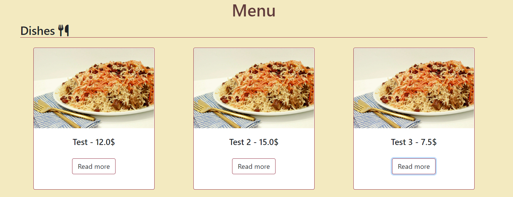

# Afghan Cuisine
It is often said that while others eat to live, Afghans live to eat.Since November 2022, Afghan Cuisine has been serving Afghani delicacies in Bandhagen, Stockholm. We are dedicated to giving our customers traditional and ethnic Afghan cuisine such as lamb, chicken, and beef curries, Afghani chicken, lamb, and Shaami Kabab, and much more. Afghan Cuisine is to honour Afghanistan and bring its food and culture to Sweden.

# Table of contents
* [Description](#description)
* [Design](#design)
* [Setup](#setup)

# Design

## Wireframes
Some additional elements that are not apparent on the wireframes were incorporated during the site's development, so the wireframes differ slightly from the actual website.

## Database schema
Several custom models were created for the development of the site. First of all, in order for the customers to book reservations, a reservations model was created which had tables and user as foreign keys. A table model was then created to link it up with the reservation model. For the menu app two models were created, one for the dishes (Dish) and one for the drinks (Drink). Furthermore a allergens model was created that had a ManyToMany relationship with the dish model.

## Color scheme
The color scheme was carefully designed and chosen to ensure that the site has a great color contrast. Furthermore, when selecting colors, the fact that the restaurant is a Middle Eastern restaurant was taken into account in order to provide users with a Middle Eastern vibe and environment.

# UX
## Site-Goals
The site's goal is to allow external users to book one or more guests for a meal in the restaurant on a specific date and time. External users can also manage their reservations on the website. The site also seeks to provide restaurant owners with the option to manage their restaurant bookings system as well as their menu presented on the website.

## The site's ideal user
- The ideal user is a food lover who wants to taste new foods from various cultures. 
- Someone who enjoys Middle Eastern cuisines.
- An Afghan who wishes to experience their homeland in Sweden.

# Agile Development
Agile Methodology was used to create the website. Github was used for agile project planning for this project. The issues on Github were used to build user stories and label them to ensure that the sites' fundamental requirements were met. The user stories defined the issue's aim and included an acceptance criteria section to identify the functionality that marked the user story as complete. The 24 user stories were then organized into 5 epics. Following that, a kanban board with four separate columns was made using github projects. The columns were no status, to do, in progress, and done.

### Epics
- Website's foundations
- Menu
- Admin site control
- Reservation functionality
- Authentication

### User Stories
- Website's foundations:
    * As a user I can easily navigate through the site so that I can access different parts.
    * As a user I feel welcomed by the home page and so that I know that I get attracted to book a reservation.
    * As a user I can use the footer so that I can access the site’s social media.
    * As a user I can send a contact form so that I can send feedback or any other question to the restaurant staff.
    * As a user I can read about the restaurant so that I can get to know what kind of restaurang it is.
    
- Menu:
    * As a User I can click on a menu item so that I can read the full description of it.
    * As a User I can view a list of menu items so that I can select one to order.
    * As a User I can view allergy icons on menu items so that I can avoid menu items that I am allergic to.
    * As a UserI can view the name, picture and description of every menu item so that I can learn about the menu item.
    * As a User I can view nutrition information of every menu item so that I can learn more about the menu item

- Admin site control
    * As a Site Admin I can create, read, update and delete drinks and food so that I can manage my restaurant’s menu
    * As a Site Admin I can approve/disapprove reservations so that I can manage my restaurant’s bookings.
    * As a Site Admin I can login to my account so that I can access and manage the website's backend.
    * As a Site Admin I can view filter options on the database tables so that I can filter them as desired.
    * As a logged in Site Admin I can navigate to the admin page from the navbar so that I can easily access the site’s backend.

- Reservation functionality
    * As a logged in User I can view my bookings so that I can see the status of all my bookings.
    * As a logged in User I can send a reservation request so that i can visit the restaurant if the reservation is approved.
    * As a logged in User I can create, read, update and delete reservations so that I can manage my bookings.
    * As a logged in User I can choose the amount of guests I want to reserve a table for so that I can determine the number of guests.
    * As a logged in User I can submit the reservations form with pre populated details so that I can quickly submit the form.

- Authentication
    * As a User I can login or register an account so that I can book a reservation.
    * As a logged in User I can edit my account information so that I can make sure that my details are correct.
    * As a User I can choose to register an account with my facebook, gmail or twitter account so that I can comfortably create an account.
    * As a User I can choose to save my account login details so that I can efficiently login every time I visit the site.

### Scope
* Reponsive Design.
* Date/Time-based bookings.
* Booking Cancellations.
* Restricted role based features.
* Menu page with food and drinks section.
* Landing page with information about the restaurant.
* Social account login possability.

# Features
- Navigation bar
    * This section includes the logo of the site and a responsive navigation bar with a hamburger menu for smaller screens. This header is present in all of the site’s pages.
    * The nav bar allows users to easily navigate from one section to another and it is responsive for mobile screens with the navigation links turning into a hamburger menu.
    * For logged in users a link to their ‘My Reservations’ page is added and for a logged in admin user a link to the admin page is added.

- Landing page
    * The landing page includes a welcoming message and the restaurant's slogan. It also consists of a background image of a served table in the restaurant.
    * The landing page introduces the users to Afghan Cuisine and welcomes them to the restaurant site while the slogan on this section encourages users to learn more about the restaurant and view the menu.

- About section
    * This section contains information on the restaurant, its opening hours, and contact information such as an email address and phone number.
    * This section informs people about the type of restaurant Afghan Cuisine is and the varieties of food they provide. It also tells the user what time the restaurant is open for business.

- Contact section
    * The contact area includes a functional form where the user can enter their full name, email address, and a message to send to us. It also includes a photograph of a restaurant entrée.
    * Users can offer us feedback or ask questions about the restaurant via the contact section of the website. The photo in this part gives users a taste of what the restaurant has to offer, encouraging them to make a reservation.

- Footer 
    * The footer consists of links to the restaurant's social media accounts so that the user can access.

- Booking reservation page
    * This section contains a form that the logged-in user can use to book a reservation. If the user is not logged in, they are advised to log in or create an account before making a reservation.
    * This area is an important part of the website because it is from here that the user may make a reservation to visit the restaurant. For the convenience of the users, the form is also prepopulated. The reservation booking form has form validation features to ensure that the user enters valid values.

- Viewing the reservation
    * This page displays all reservations and associated data in a table for logged-in users.
    * Users can view their reservations as well as their associated details. They can also amend or delete any of their reservations, providing them the opportunity to remedy any errors in the reservation details. In this section, defensive programming is used, so that when a user attempts to delete a specific reservation, a confirmation modal appears for them to affirm their decision.

- Menu
    * This page displays all of the restaurant's menu items. There are separate sections for the dishes and drinks. The menu items are all presented as cards. The cards include the item's name and price, a picture of the menu item, a description of the item, and nutrition information.
    * This section allows consumers to see all of the food and drinks that the restaurant offers so that they know what they can order in the restaurant. It also displays nutrition information such as calorie, protein, and fat content, as well as allergen icons, allowing the user to avoid undesirable menu items.

## Technologies Used

During the development of this project serveral technologies have been used:

- [Django](https://www.djangoproject.com/)
    - Django is the main framework that was utilized to create the overarching project and its applications.
- [Python](https://www.python.org/)
    - Python was used to write the core logic of the site.
- [Bootstrap](https://getbootstrap.com/)
    - Bootstrap was used to creat and design a responsive site.
- [Font Awesome](https://fontawesome.com/)
    - Fontawesome icons are used throughout the website.
- [Google Developer Tools](https://developers.google.com/web/tools/chrome-devtools)
    - Google developer tools was used to detect bugs and manage responsivness.
- [GitHub](https://github.com/)
    - Github is used to store the code of this project.
- [Git](https://git-scm.com/)
    - Git was used for version control
- [Gitpod](https://www.gitpod.io/)
    - Gitpod was used as the development environment.
- [Heroku](https://dashboard.heroku.com/apps)
    - Heroku was used to deploy and host the project.
- [Lucid](https://lucid.app/documents#/dashboard)
    - Lucid was used to create the database schema.
- [Cloudinary](https://cloudinary.com/)
    - Cloudinary was used to store the static files of the site.
- [Favicon.io](https://favicon.io/)
    - Favicon was used to create favicon's for the site.
- [SQLite](https://www.sqlite.org/index.html)
    - SQLite was used to run the database locally under development.
- [ElephantSQL](https://www.elephantsql.com/)
    - ElephantSQL was used to store the data of the site.

